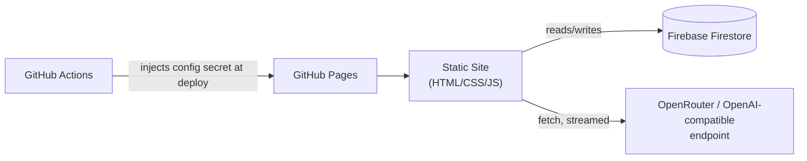

# Nera Chat — System Specification

Frontend-only web app (vanilla HTML/CSS/JS, no build step), hosted on GitHub Pages, using Firebase Firestore as the sole backend for settings, provider config, prompts, sessions, and chat history. Dark mode only. Single admin user, simple credential check (no hashing).

---

## 1. High-Level Architecture



Nothing runs server-side except Firestore itself and its security rules. All context assembly, token counting, summarization triggering, and streaming parsing happen in the browser.

---

## 2. Firestore Data Model

Single Firestore project, single logical "workspace" (one admin user). Suggested top-level structure:

```
/auth/credentials                 { username, password }   // plaintext, manually edited by you in console
/settings/global                  provider + context + prompt settings (see §4)
/sessions/{sessionId}             session metadata (see §5)
/sessions/{sessionId}/messages/{messageId}   ordered messages (see §5)
```

### `/auth/credentials`
```json
{ "username": "admin", "password": "123" }
```
Seeded once manually in the Firebase console. The app reads this doc, compares it client-side against the login form, and on match sets a `sessionStorage` flag to unlock the UI. This is a UI gate, not real access control — see §9 (Security) for the honest caveat and one optional hardening step.

### `/settings/global`
Holds everything described in §4.

### `/sessions/{sessionId}`
```json
{
  "title": "My Fantasy Campaign",
  "createdAt": <timestamp>,
  "updatedAt": <timestamp>,
  "longTermPlan": "string, hidden from chat view, edited only in Settings tab",
  "activeSummaryMessageId": "msg_123 | null",
  "breakpointOrder": 42
}
```
- `breakpointOrder`: the `order` value of the last raw message that has been folded into the current summary. Only messages with `order > breakpointOrder` (plus the active summary itself) are sent to the LLM as history.
- `activeSummaryMessageId`: points at the messages-subcollection doc (role `summary`) that holds the current rolling summary. Older summary docs are never deleted — they just stop being referenced.

### `/sessions/{sessionId}/messages/{messageId}`
```json
{
  "role": "user | assistant | summary",
  "content": "visible text (plan tags already stripped for assistant messages)",
  "thinking": "reasoning/thinking text, assistant only, or null — reference only, never resent to the API",
  "tokenCount": 187,
  "order": 43,
  "createdAt": <timestamp>,
  "editedAt": <timestamp|null>
}
```
`order` is a monotonically increasing integer per session (not a Firestore timestamp) — this avoids clock-skew ordering bugs and gives clean integer arithmetic for the breakpoint math above. Simplest implementation: keep a `nextOrder` counter on the session doc and increment it transactionally each time a message is added.

Nothing is ever deleted by the sliding-window or summarization logic — those only change what gets *sent* to the LLM. Deletion happens only when you explicitly delete a message.

---

## 3. Authentication & Security (honest tradeoffs)

- Login screen checks the typed username/password against `/auth/credentials` client-side, plaintext, no hashing — exactly as you asked.
- Firebase config (API key, project ID, etc.) is not a secret in the traditional sense, but per your note you want it out of the committed source. Recommended approach for a build-step-free vanilla app:
  - Commit `firebase-config.example.js` (placeholder values) to the repo.
  - Keep the real `firebase-config.js` **git-ignored** for local dev.
  - For deployment, add a small GitHub Actions workflow that, on push to `main`, writes `firebase-config.js` from a repository secret (`FIREBASE_CONFIG_JSON` or individual secrets) before publishing to GitHub Pages. No bundler needed — it's just a file-write step before the Pages artifact upload.
- **Important caveat to be upfront about:** because this is a static site with no server, the login screen can only gate the *UI*. If Firestore security rules allow open read/write (`allow read, write: if true`), anyone who inspects your deployed JS and copies the Firebase config could talk to your Firestore directly, bypassing the login screen entirely. That may be an acceptable risk for a personal hobby project, but it's worth deciding consciously rather than by accident.
- **Minimal, still-simple hardening option (optional):** enable Firebase Anonymous Authentication and set Firestore rules to `allow read, write: if request.auth != null;`. The app silently signs in anonymously on load (one extra SDK call, no UI, no password), and now at least casual bots/scrapers scanning for open Firestore projects can't touch your data without going through Firebase Auth first. This does **not** replace your login screen (still checks username/password for you personally); it just closes the "config leaked in plain JS" hole a little. Entirely your call — flagging it, not insisting on it.

---

## 4. Settings Schema (`/settings/global`)

### 4.1 Provider connection
| Field | Type | Default | Notes |
|---|---|---|---|
| `endpoint` | string | `https://openrouter.ai/api/v1/chat/completions` | Free text so any OpenAI-compatible endpoint works |
| `apiKey` | string | — | Stored in Firestore, used directly from the browser (visible in devtools/network — acceptable per your answer) |
| `modelId` | string | — | Free text, e.g. `anthropic/claude-3.5-sonnet`, `deepseek/deepseek-r1` |
| `streaming` | boolean | `true` | If false, falls back to a normal (non-streamed) fetch |
| `maxResponseTokens` | number | `1024` | Sent as `max_tokens` |
| `reasoning.enabled` | boolean | `false` | Toggles the whole reasoning/thinking feature |
| `reasoning.mode` | `"effort" \| "max_tokens"` | `"effort"` | Which of the two mutually-exclusive OpenRouter reasoning controls to send |
| `reasoning.effort` | `"minimal"\|"low"\|"medium"\|"high"\|"xhigh"\|"none"` | `"medium"` | Used when `mode = "effort"` |
| `reasoning.maxTokens` | number | `2000` | Used when `mode = "max_tokens"` (only some models support this — Anthropic/Gemini/some Qwen) |

Confirmed from OpenRouter's current docs: requests carry a single `reasoning` object, e.g.
```json
"reasoning": { "effort": "high", "exclude": false, "enabled": true }
```
or
```json
"reasoning": { "max_tokens": 2000 }
```
— never both `effort` and `max_tokens` together. `exclude: true` would suppress reasoning text from being returned at all; you want it returned but not persisted into context, so `exclude` stays `false` and the exclusion happens on *our* side (see §6).

### 4.2 Context & summarization
| Field | Type | Default | Meaning |
|---|---|---|---|
| `maxContextTokens` | number | `8000` | Total context window budget you're allocating for prompt assembly (set this below your chosen model's real limit) |
| `autoSummarizationEnabled` | boolean | `false` | Whether context usage can trigger automatic summarization; when off, the context builder still uses its sliding window |
| `autoSummaryThresholdPercent` | number | `70` | When assembled context reaches this % of `maxContextTokens`, auto-summarization fires |
| `keepRecentMessagesAfterSummary` | number | `10` | After summarizing, exactly this many most-recent raw messages stay out of the summary and remain in context verbatim |

Note (not asked for, but necessary for correctness): `maxContextTokens` should be treated as the budget for *everything sent to the model* — narrator system prompt + long-term plan + summary + sliding-window messages + the new user turn — with `maxResponseTokens` reserved separately on top. The context-builder in §6 accounts for this.

### 4.3 Prompts (global, shared across all sessions — per your answer)
| Field | Type |
|---|---|
| `narratorSystemPrompt` | string, user-editable |
| `summarizerSystemPrompt` | string, user-editable |

---

## 5. Multiple Chat Sessions

- A sidebar lists all `/sessions` docs (title, last-updated). Create / rename / delete / switch between them.
- Each session is fully independent: its own messages subcollection, its own `longTermPlan`, its own `breakpointOrder` / `activeSummaryMessageId`.
- Narrator/summarizer prompts and provider/context settings are global (shared), per your answer.

---

## 6. Context Window Assembly

### 6.1 Token counting
Exact per-model tokenization isn't realistic when `modelId` is free text spanning many providers/tokenizers. Recommended approach: use a real BPE tokenizer as a *consistent approximation* across all models — e.g. the `cl100k_base` encoding via a browser-ready JS tokenizer library (there are pure-JS ports that need no WASM/build step, loadable via a `<script>` tag from a CDN). This gets you "nearly exact" for OpenAI-family models and a close-enough estimate for everything else.

To satisfy your "round up, never cut a message midway" requirement:
- Every message's token cost is computed once (at send/edit/import time) and **cached** as `tokenCount`, then rounded **up** to the next whole number (and optionally padded by a small fixed safety margin, e.g. +2%) — this guards against the approximation under-counting and accidentally blowing the real limit.
- Context is built strictly at **message granularity**. A message is either included whole or excluded whole — never truncated mid-text. This falls out naturally from the algorithm below.

### 6.2 Algorithm (pseudocode)
```
function buildContextForRequest(session, settings):
    fixedOverhead = tokensOf(settings.narratorSystemPrompt) + tokensOf(session.longTermPlan)
    budget = settings.maxContextTokens - settings.maxResponseTokens - fixedOverhead

    parts = [ {role: "system", content: settings.narratorSystemPrompt + planInjectionBlock(session)} ]

    if session.activeSummaryMessageId:
        summaryMsg = getMessage(session.activeSummaryMessageId)
        parts.push({role: "system", content: "Story so far:\n" + summaryMsg.content})
        budget -= summaryMsg.tokenCount   // already rounded up + cached

    candidates = getMessages(session)
                   .filter(m => m.role != "summary" && m.order > session.breakpointOrder)
                   .sortDescendingByOrder()   // newest first

    windowed = []
    for m in candidates:
        if budget - m.tokenCount < 0:
            break                      // stop BEFORE exceeding — whole-message boundary only
        windowed.unshiftFront(m)
        budget -= m.tokenCount

    parts.push(...windowed, currentUserTurn)
    return parts
```

This is the "sliding window" — as the conversation grows, the oldest messages naturally fall off the `windowed` list first (they're the first candidates evaluated from the back and the first to get cut once budget runs out... actually evaluated newest-first, so it's the *oldest* ones in `candidates` that never make it in). Once a message falls out of the window, it is not lost from Firestore — only from what's sent to the LLM — until a summarization pass moves the breakpoint forward, at which point it becomes permanently folded into the summary rather than raw.

### 6.3 Long-term plan injection
`planInjectionBlock(session)` appends something like:
```
Current long-term plan (update it by including a new <plan>...</plan> block in your reply if it changes; omit the tag to leave it unchanged):
{session.longTermPlan}
```
into the system message, so the model always sees and can revise it, while it never appears in the visible chat transcript.

---

## 7. Streaming & Thinking/Reasoning Handling

Confirmed from OpenRouter's current streaming docs: responses are standard SSE (`text/event-stream`). Each event line looks like:
```
data: {"choices":[{"delta":{"content":"...", "reasoning":"..."}}], ...}
```
terminated by a final `data: [DONE]`. OpenRouter also occasionally sends `:` -prefixed keep-alive comment lines that must be skipped (not JSON-parsed). The final content-bearing chunk (or a following usage-only chunk) carries `usage.completion_tokens_details.reasoning_tokens` and total usage — handy for an optional cost/usage readout later, though you said skip that for now.

**Parsing logic per chunk:**
- `delta.content` → live-append to the visible "response" pane, and this is what eventually becomes the stored `message.content`.
- `delta.reasoning` → live-append to a separate collapsible "thinking" pane shown above/alongside the response while streaming. Stored as `message.thinking` for your own later reference. **Never** re-included in any future `buildContextForRequest` call — this satisfies your "only response is added into context, thinking is not" requirement exactly, since §6's context builder only ever reads `message.content`.
- Reasoning is billed and returned as part of the assistant turn; `reasoning.exclude` stays `false` so you get to see it, but it's excluded from context by construction, not by asking the provider to omit it.

If streaming is toggled off in settings, the same request is sent with `stream: false` and the full response is parsed from the single JSON body instead (`choices[0].message.content` / `.reasoning`).

---

## 8. Summarization

### 8.1 Triggers
- **Manual:** a "Summarize" button, always available.
- **Automatic:** checked once after each assistant reply is saved — if the token total that *would be* used by `buildContextForRequest` for the *next* turn is ≥ `autoSummaryThresholdPercent`% of `maxContextTokens`, summarization runs automatically before the next user message is allowed to send (or immediately, your choice — either is a small implementation detail).

### 8.2 Process (pseudocode)
```
function runSummarization(session, settings):
    N = settings.keepRecentMessagesAfterSummary
    rawMsgs = getMessages(session).filter(role != "summary").sortAscendingByOrder()

    // keep the last N raw messages OUT of this summarization pass
    newBreakpointOrder = rawMsgs[len(rawMsgs) - N].order

    toFoldIn = rawMsgs.filter(order > session.breakpointOrder && order <= newBreakpointOrder)

    priorSummaryText = session.activeSummaryMessageId
        ? getMessage(session.activeSummaryMessageId).content
        : null

    summarizerInput =
        (priorSummaryText ? "Previous summary:\n" + priorSummaryText + "\n\n" : "")
        + "New events to fold in:\n" + formatAsTranscript(toFoldIn)

    newSummaryText = callLLM(settings.summarizerSystemPrompt, summarizerInput)   // separate, simple non-streamed call is fine here

    newSummaryMsg = appendMessage(session, role: "summary", content: newSummaryText)
    session.activeSummaryMessageId = newSummaryMsg.id
    session.breakpointOrder = newBreakpointOrder
    saveSession(session)
```
This matches your spec exactly: the *new* summary always folds in the *old* summary plus everything since the last breakpoint; only the newest summary is ever used for context going forward; every previous summary remains permanently in the messages log (as a `role: "summary"` entry) purely as history, visible if you scroll back, but excluded from future context.

---

## 9. Message Editing / Regeneration / Deletion

Per your answers, all of this is intentionally simple:
- **Edit** (user or assistant message): overwrite `content` in place, update `editedAt`, recompute `tokenCount`. Everything after it in the conversation is left exactly as-is — no cascade, no flagging.
- **Regenerate** (assistant message only): re-run the request using context built as of just before that message, overwrite the same message's `content`/`thinking`/`tokenCount` in place. No alternate-version/swipe history.
- **Delete**: explicit user action, removes the Firestore doc entirely (this is the only path that truly loses data — the sliding window/summary mechanisms never do).

---

## 10. SillyTavern Import / Export (chat log only, no character cards)

Confirmed current format: SillyTavern exports chats as **JSONL** — one JSON object per line, no wrapping array.
- **Line 1** is a metadata header, shape approximately:
  ```json
  {"user_name": "...", "character_name": "...", "create_date": "..."}
  ```
- **Every subsequent line** is one message:
  ```json
  {"name": "...", "is_user": true|false, "send_date": "...", "mes": "the message text", ...}
  ```
  (Additional fields like `extra`, `is_name`, `send_date` format may vary slightly by ST version — worth confirming against one real exported file before finalizing the parser, but the `is_user` / `mes` / `name` core shape is stable and is what several third-party tools already interoperate with.)

**Import mapping:** skip/ignore the header line (or optionally use it to prefill the new session's title), then for each remaining line: `is_user: true` → `role: "user"`, otherwise → `role: "assistant"`, `mes` → `content`. Messages get sequential `order` values in file order. A new session is created to hold the import.

**Export mapping:** reverse of the above — write the header line, then one line per stored message (excluding `role: "summary"` entries, since ST has no concept of those) in `{name, is_user, send_date, mes}` shape, so the file can be re-opened in SillyTavern if you ever want to.

---

## 11. Long-Term Plan Mechanism

- The narrator system prompt (via `planInjectionBlock`, §6.3) tells the model it may update the plan by emitting a `<plan>...</plan>` block anywhere in its reply.
- After a full (non-streamed-remainder) reply is received, the app scans the raw text for `<plan>...</plan>`:
  - If found: extract the inner text → save as `session.longTermPlan` → **strip the tag entirely** from what gets stored as the visible `message.content` and shown in the chat transcript.
  - If absent: plan is left unchanged.
- The plan is never rendered in the main chat view. It only appears, read-and-write, in a field on that session's Settings tab — exactly as you specified.

---

## 12. UI Layout

- **Sidebar:** session list (create / rename / delete / switch).
- **Chat tab (default view):**
  - Message list, newest at bottom. Each bubble has hover-revealed **Edit**, **Delete**, and (assistant only) **Regenerate** controls.
  - While an assistant reply is streaming: a live "thinking…" collapsible region (populated from `delta.reasoning`) above a live-growing response region (from `delta.content`). Once done, the thinking region collapses but stays click-to-expand (backed by the stored `message.thinking`).
  - A small context-usage indicator (e.g. "5,600 / 8,000 tokens" with a bar) so you can see how close you are to the auto-summary threshold.
  - A **Summarize** button, always available.
- **Settings tab**, sub-sections:
  - Connection (endpoint, API key, model ID, reasoning mode/effort/max_tokens, streaming toggle, max response tokens)
  - Context & Summarization (max context tokens, auto-summary threshold %, keep-N-after-summary)
  - Prompts (narrator system prompt, summarizer system prompt — both editable, global)
  - This Session (long-term plan editor — per-session, only reachable here)
  - Import / Export (SillyTavern JSONL, both directions)
- Dark theme only, as specified.

---

## 13. Suggested File Structure (for whichever environment you build this in)

```
/index.html
/css/style.css
/js/
  firebase-config.example.js     (committed placeholder)
  firebase-config.js             (git-ignored, real values; or injected at deploy)
  app.js                         (bootstrap / router between Chat & Settings tabs)
  auth.js                        (login gate against /auth/credentials)
  db.js                          (thin Firestore read/write helpers)
  settings.js                    (load/save /settings/global)
  sessions.js                    (CRUD for /sessions)
  messages.js                    (CRUD for messages subcollection, order counter)
  llm-client.js                  (builds request, handles SSE parsing per §7)
  tokenizer.js                   (cl100k_base-based counting + rounding rules)
  context-builder.js             (§6 algorithm)
  summarizer.js                  (§8 algorithm)
  plan-parser.js                 (§11 <plan> tag extraction/stripping)
  import-export.js               (§10 SillyTavern JSONL both ways)
  ui/
    chat-view.js
    settings-view.js
    sidebar.js
.github/workflows/deploy.yml     (writes firebase-config.js from a repo secret, publishes to Pages)
```

---

## 14. Things to Verify at Implementation Time (flagged honestly, not guessed)

1. **Reasoning parameter support varies by model** — `reasoning.max_tokens` only works on Gemini thinking models, Anthropic reasoning models, and some Qwen thinking models; everything else (OpenAI o-series/GPT-5, Grok) only accepts `reasoning.effort`. The settings UI should probably just expose both controls and let them send whichever one the chosen model actually uses — OpenRouter will convert as needed, and non-reasoning/router models simply omit the field.
2. **SSE parsing edge cases** — must skip `:`-prefixed keep-alive comment lines before `JSON.parse`, and must handle the `[DONE]` sentinel and the final usage-only chunk that repeats `finish_reason`.
3. **Exact SillyTavern field set** — the core `{name, is_user, send_date, mes}` shape is solid, but pull one real `.jsonl` export from your own SillyTavern install and diff it against this spec before finalizing the parser, since minor fields have shifted across ST versions.
4. **Browser-safe tokenizer library** — confirm whichever `cl100k_base`-style JS tokenizer you pick has a plain `<script>`-tag-loadable browser build (no bundler), since the project is committed to a build-step-free vanilla setup.

---

This spec is intentionally scoped to exactly what you described — no added features beyond the two flagged, necessary clarifications (reserving response-token budget separately, and the fixed-overhead accounting in §6). Nothing here has been built; it's ready to hand to whatever environment you build it in.
